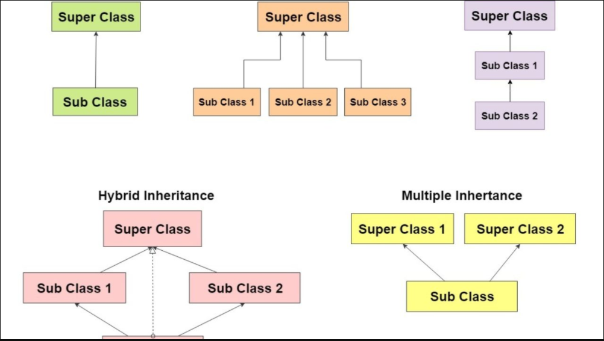

# Read6 - 401 Java 

## Object

* What's Object :

        Software bundle of related state and behavior, It used to model the real-world objects that you find in everyday life.

* What's Class :

        Blueprint or prototype from which objects are created

* What's Inheritance :

        Provides a powerful and natural mechanism for organizing and structuring your software.     

* What's Interface :

        Is a contract between a class and the outside world. When a class implements an interface, it promises to provide the behavior published by that interface      

* What's Package

        Namespace for organizing classes and interfaces in a logical manner.

## Described the Parts of object : 

