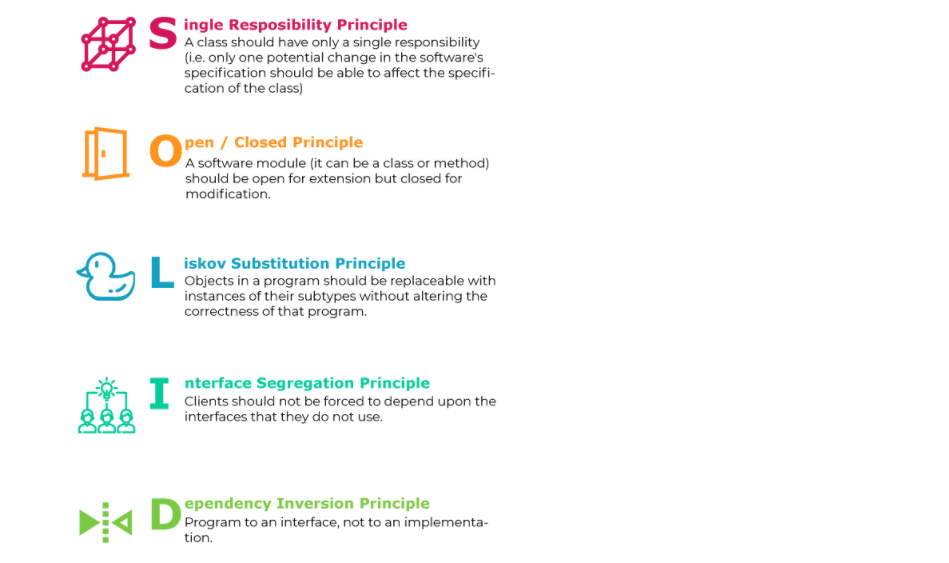

# SOLID

>**S** - Single-responsiblity Principle.`that mean every class have one job.`like class Squar ,class Circle.

>**O** - Open-closed Principle.`that mean the class extendable but without do modifying on a class.` Interface is an integral part of SOLID.

>**L** - Liskov Substitution Principle.`that means that every subclass or derived class should be substitutable for their base or parent class`

>**I** - Interface Segregation Principle.`that mean if I created interface class for shape contains two methods(area,volume) and the anothor classes implement this interface but the square class din't have volume that mean will force squere class implement method doesn't need it`

>**D** - Dependency Inversion Principle.

